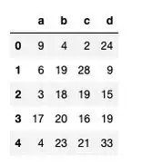
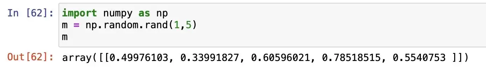
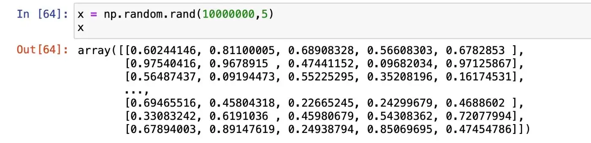
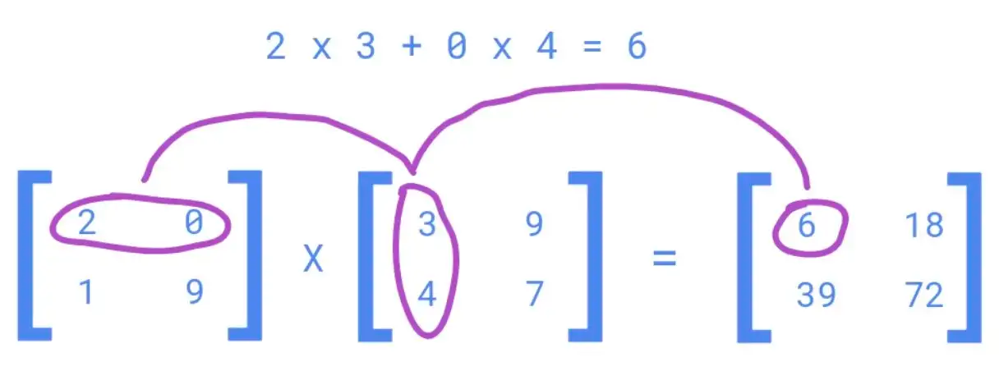

## Say Goodbye to Loops in Python, and Welcome Vectorization!

### Introduction

Loops come to us naturally, we learn about Loops in almost all programming languages. So, by default, we start implementing loops whenever there is a repetitive operation. But when we work with a large number of iterations (millions/billions of rows), using loops is a crime. You might be stuck for hours, to later realize that it won’t work. This is where implementing Vectorisation in python becomes super crucial.

### What is Vectorization?

*Vectorization is the technique of implementing (NumPy) array operations on a dataset. In the background, it applies the operations to all the elements of an array or series in one go (unlike a ‘for’ loop that manipulates one row at a time).*

In this blog, we will look at some of the use cases where we can easily replace python loops with Vectorization. This will help you save time and become more skillful in coding.

### USE CASE 1: Finding the Sum of numbers

First, we will look at a fundamental example of finding the sum of numbers using loops and Vectorization in python.

***Using Loops***

```python
import time 
start = time.time()

 
# iterative sum
total = 0
# iterating through 1.5 Million numbers
for item in range(0, 1500000):
    total = total + item


print('sum is:' + str(total))
end = time.time()

print(end - start)

#1124999250000
#0.14 Seconds

```

***Using Vectorization***

```python
import numpy as np

start = time.time()

# vectorized sum - using numpy for vectorization
# np.arange create the sequence of numbers from 0 to 1499999
print(np.sum(np.arange(1500000)))

end = time.time()

print(end - start)


##1124999250000
##0.008 Seconds

```

Vectorization took **~18x lesser time** to execute as compared to the iteration using the range function. This difference will become more significant while working with Pandas DataFrame.

### USE CASE 2: Mathematical Operations (on DataFrame)

In Data Science, while working with Pandas DataFrame, the developers use loops to create new derived columns using mathematical operations.

In the following example, we can see how easily the loops can be replaced with Vectorization for such use cases.


***Creating the DataFrame***

The DataFrame is tabular data in the form of rows and columns.

We are creating a pandas DataFrame having 5 Million rows and 4 columns filled with random values between 0 and 50.

```python
import numpy as np
import pandas as pd
df = pd.DataFrame(np.random.randint(0, 50, size=(5000000, 4)), columns=('a','b','c','d'))
df.shape
# (5000000, 5)
df.head()
```



We will create a new column ‘ratio’ to find the ratio of the column ‘d’ and ‘c’.

***Using Loops***

```python
import time 
start = time.time()

# Iterating through DataFrame using iterrows
for idx, row in df.iterrows():
    # creating a new column 
    df.at[idx,'ratio'] = 100 * (row["d"] / row["c"])  
end = time.time()
print(end - start)
### 109 Seconds
```

***Using Vectorization***

```python
start = time.time()
df["ratio"] = 100 * (df["d"] / df["c"])

end = time.time()
print(end - start)
### 0.12 seconds
```

### USE CASE 3: If-else Statements (on DataFrame)

We implement a lot of operations that require us to use the ‘If-else’ type of logic. We can easily replace these logics with Vectorization operations in python.

Let’s look at the following example to understand it better (we will be using the DataFrame that we created in use case 2):

Imagine we want to create a new column ‘e’ based on some conditions on the exiting column ‘a’.

***Using Loops***

```python
import time 
start = time.time()

# Iterating through DataFrame using iterrows
for idx, row in df.iterrows():
    if row.a == 0:
        df.at[idx,'e'] = row.d    
    elif (row.a <= 25) & (row.a > 0):
        df.at[idx,'e'] = (row.b)-(row.c)    
    else:
        df.at[idx,'e'] = row.b + row.c

end = time.time()

print(end - start)
### Time taken: 177 seconds
```

***Using Vectorization***

```python
# using vectorization 

start = time.time()
df['e'] = df['b'] + df['c']
df.loc[df['a'] <= 25, 'e'] = df['b'] -df['c']
df.loc[df['a']==0, 'e'] = df['d']end = time.time()
print(end - start)
## 0.28007707595825195 sec
```

Time taken by the Vectorization operation is 600x faster as compared to the python loops with if-else statements.

### USE CASE 4 (Advance): Solving Machine Learning/Deep Learning Networks

Deep Learning requires us to solve multiple complex equations and that too for millions and billions of rows. Running loops in Python to solve these equations is very slow and Vectorization is the optimal solution.

For example, to calculate the value of y for millions of rows in the following equation of multi-linear regression:


we can replace loops with Vectorization.

The values of m1,m2,m3… are determined by solving the above equation using millions of values corresponding to x1,x2,x3… (for simplicity, we will just look at a simple multiplication step)

***Creating the Data***

```python
import numpy as np
# setting initial values of m 
m = np.random.rand(1,5)

# input values for 5 million rows
x = np.random.rand(5000000,5)
```





***Using Loops***

```python
import numpy as np
m = np.random.rand(1,5)
x = np.random.rand(5000000,5)

total = 0
tic = time.process_time()

for i in range(0,5000000):
    total = 0
    for j in range(0,5):
        total = total + x[i][j]*m[0][j] 
        
    zer[i] = total 

toc = time.process_time()
print ("Computation time = " + str((toc - tic)) + "seconds")

####Computation time = 28.228 seconds
```

***Using Vectorization***



```python
tic = time.process_time()

#dot product 
np.dot(x,m.T) 

toc = time.process_time()
print ("Computation time = " + str((toc - tic)) + "seconds")

####Computation time = 0.107 seconds
```

The np.dot implements Vectorized matrix multiplication in the backend. It is 165x faster as compared to loops in python.

***Conclusion***

Vectorization in python is super fast and should be preferred over loops, whenever we are working with very large datasets.

Start implementing it over time and you will become comfortable with thinking along the lines of vectorization of your codes.